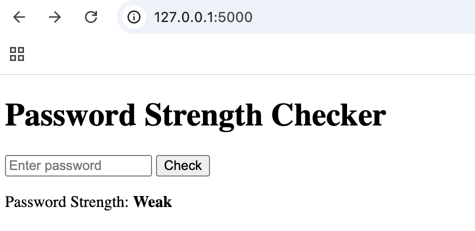

# Password Strength Checker 🔐

[](https://www.python.org/)
[](https://flask.palletsprojects.com/)
[](https://opensource.org/licenses/MIT)

A simple **Flask web application** that checks password strength and tells you if your password is **Weak, Moderate, or Strong**.

## 🚀 How to Run the Project

1. Clone the repository:
   ```bash
   git clone https://github.com/mcgheeasher/password-strength-checker.git
   cd password-strength-checker

2. **Create a virtual environment**  
   ```bash
   python3 -m venv venv
   source venv/bin/activate

3. **Install dependencies
   ```bash
   pip install -r requirements.txt
	
4. **Run the app
   ```bash
   python app.py

5. **Open your browser and go to:
   http://127.0.0.1:5000/

📸 Screenshot



✨ Features

Checks password strength

Simple and clean UI

🚧 Future Improvements

AJAX updates

More detailed feedback

Unit tests
